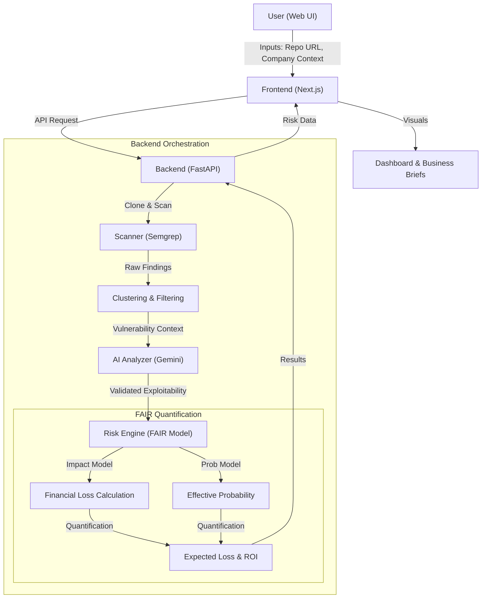

# FinRisk Project Documentation

## 3. Block Diagram / Data Flow

The following diagram illustrates the end-to-end data flow from the user initiation to the generation of financial risk reports.

### Data Flow Steps:
1.  **Ingestion:** The user provides a repository URL and organizational context via the Next.js frontend.
2.  **Collection:** The FastAPI backend clones the repo and runs Semgrep (SAST/SCA) to identify potential security issues.
3.  **Refinement:** Findings are clustered to remove noise and filtered to exclude non-production code.
4.  **Augmentation:** GEMINI AI analyzes the code context to validate exploitability and adjust probability scores.
5.  **Quantification:** The engine applies the FAIR model, calculating financial impact across categories (Data Breach, Regulatory, etc.) and determining Expected Loss.
6.  **Reporting:** Results are ranked by ROI and presented back to the user as actionable business insights.

