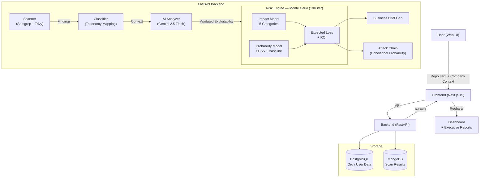

<p align="center">
  
</p>

<h1 align="center">CyberFinRisk</h1>

<p align="center">
  <em>Vulnerability Financial Impact Engine — FAIR-lite Monte Carlo risk quantification that translates security findings into dollar-denominated expected loss</em>
</p>

<p align="center">
  <a href="https://www.python.org/downloads/"></a>
  <a href="https://nextjs.org/"></a>
  <a href="https://fastapi.tiangolo.com/"></a>
  <a href="https://semgrep.dev/"></a>
  <br>
  <a href="https://github.com/ASA-aiml/cyberfinrisk/actions"></a>
  <a href="https://hub.docker.com/r/asaaiml/cyberfinrisk"></a>
  <a href="https://github.com/ASA-aiml/cyberfinrisk/blob/main/frontend/LICENSE"></a>
  <a href="https://github.com/ASA-aiml/cyberfinrisk/releases"></a>
  <a href="https://cyberfinrisk.vercel.app"></a>
  <a href="https://github.com/ASA-aiml/cyberfinrisk/issues"></a>
</p>

---

> **Not another CVSS dashboard.** A mathematically defensible answer to "which vulnerability should we fix first?"

**CyberFinRisk** is an advanced cybersecurity risk quantification platform that transforms technical vulnerability findings into **financial risk insights**. Instead of prioritizing by severity (CVSS), it tells you the **expected financial impact in dollars** — enabling data-driven, business-aligned remediation decisions.

---

## Features

| | | |
|---|---|---|
| 🕵️ **Automated Scanning** — Semgrep SAST + Trivy SCA, clone-and-scan any GitHub repo | 🧠 **AI Exploitability** — Gemini 2.5 Flash validates reachability and exploits context | 💰 **Financial Impact** — 5-category FAIR-lite model: breach, regulatory, downtime, response, reputation |
| 📊 **Monte Carlo Simulation** — 10K iterations, triangular distributions, P50/P90 confidence intervals | 🔗 **Attack Chain Analysis** — Conditional probability for chained multi-vuln blast radius | 📈 **ROI Prioritization** — `Expected Loss / Fix Cost` ranking, fix what matters most |
| 🛠️ **AI Remediation** — Context-aware secure code fixes with developer-friendly explanations | 📋 **Executive Briefs** — Business-language reports with urgency labels and cost breakdowns |

---

## How It Works

<p align="center">
  
  ➡️
  
  ➡️
  
  ➡️
  
  ➡️
  
  ➡️
  
</p>

1. **Scan** — Clone the target repo and run Semgrep (SAST, OWASP Top 10) + Trivy (SCA, secrets, IaC)
2. **Classify** — Map findings to a unified 17-type taxonomy, deduplicate, filter non-production files
3. **AI Analyze** — Gemini 2.5 Flash examines code context to validate exploitability, authentication, input sanitization
4. **Quantify** — Monte Carlo engine (10K iterations) computes expected loss across 5 impact categories with P50/P90 confidence intervals
5. **Report** — Generate executive business briefs with urgency labels, ROI-ranked fix list, and attack chain amplification

---

## Architecture



| Layer | Technology | Purpose |
|-------|-----------|---------|
| **Frontend** | Next.js 15, React 19, Recharts, Tailwind CSS 4 | Dashboard, visualizations, executive reports |
| **Backend** | FastAPI, Python 3.11+, Pydantic | API, orchestration, data validation |
| **Scanner** | Semgrep (SAST), Trivy (SCA/IaC) | Vulnerability detection |
| **AI** | Google Gemini 2.5 Flash | Exploitability validation, fix generation |
| **Risk Engine** | Monte Carlo (stdlib `random.triangular`) | Expected loss, confidence intervals, ROI |
| **Storage** | PostgreSQL (relational), MongoDB (documents) | User/org data, scan results |
| **Observability** | OpenTelemetry, Prometheus, Grafana | Metrics, tracing, dashboards |
| **CI/CD** | GitHub Actions, SonarQube, Docker | Lint, test, scan, containerize |

---

## Quick Start

### Local Development

```bash
# Clone
git clone https://github.com/ASA-aiml/cyberfinrisk.git
cd cyberfinrisk

# Backend
cd backend
python -m venv venv && source venv/bin/activate
pip install -r requirements.txt
cp .env.example .env   # Add GEMINI_API_KEY (optional for scanning, required for AI)
uvicorn main:app --reload

# Frontend (separate terminal)
cd frontend
npm install
cp .env.example .env.local
npm run dev
```

Open **http://localhost:3000** — the backend runs at **http://localhost:8000**.

### Docker

```bash
docker compose up
# Frontend: http://localhost:3000
# Backend:  http://localhost:8000
# Grafana:  http://localhost:3001 (admin/admin)
```

### Engine Self-Check (no API key, no DB needed)

```bash
cd backend && PYTHONPATH=. python -m engine
```

Runs the Monte Carlo engine, priority scorer, impact model, and benchmark with synthetic data.

---

## API Reference

| Method | Endpoint | Description |
|--------|----------|-------------|
| `POST` | `/scan-repo` | Clone a GitHub repo, run scanners, compute financial risk (streaming) |
| `POST` | `/analyze-manual` | Analyze manually-supplied vulnerabilities with company context |
| `GET`  | `/health` | System health check — scanners, DB, AI provider |
| `GET`  | `/api/projects` | List scanned projects |
| `GET`  | `/api/projects/{id}` | Get project risk results and dashboard data |
| `POST` | `/api/projects/{id}/solve` | Generate AI-powered fix for a specific vulnerability |

### Request Example

```json
POST /scan-repo
{
  "repo_url": "https://github.com/org/repo.git",
  "company": {
    "company_name": "Acme Corp",
    "industry": "finance",
    "annual_revenue": 10000000,
    "active_users": 50000,
    "arpu": 20,
    "regulatory_frameworks": ["GDPR", "PCI_DSS"]
  }
}
```

---

## Project Structure

```
cyberfinrisk/
├── backend/
│   ├── main.py                  # FastAPI application (endpoints, auth, DB)
│   ├── engine/                  # Core risk engine
│   │   ├── expected_loss.py     # Monte Carlo simulation, risk score 0-1000, ROI
│   │   ├── impact_model.py      # 5-category financial impact + regulatory caps
│   │   ├── probability_model.py # EPSS + baseline exploit probabilities
│   │   ├── gemini_analyzer.py   # AI-powered exploitability validation
│   │   ├── scanner.py           # Semgrep + Trivy orchestration
│   │   ├── attack_chain.py      # Multi-vuln conditional probability
│   │   ├── business_brief.py    # Executive summary generator
│   │   ├── classifier.py        # Rule-ID to bug-type mapping
│   │   └── __main__.py          # Self-check demo
│   ├── models/                  # Pydantic schemas + SQLAlchemy/MongoDB models
│   ├── knowledge_base/          # Industry benchmarks (breach costs, regs, etc.)
│   ├── requirements.txt
│   └── Dockerfile
├── frontend/
│   ├── src/                     # Next.js 15 App Router pages/components
│   ├── tests/                   # Jest unit + Playwright E2E
│   └── Dockerfile
├── tests/                       # Pytest suite (43 tests)
├── helm/                        # Kubernetes Helm chart
├── monitoring/                  # Prometheus + Grafana + OpenTelemetry config
├── .github/workflows/           # CI/CD pipeline
└── docker-compose.yml           # Full stack orchestration
```

---

## Benchmarks

| Metric | Value | Conditions |
|--------|-------|------------|
| Monte Carlo throughput | 198K iterations/sec | 10K iterations, single thread, stdlib `random` |
| P50 convergence | ±1.8% at 5K iterations | 100 repeated trials, 95% CI |
| Mean compute time | 31ms per 10K iterations | Warm `Random` instance |
| AI pipeline (parallel) | 18 findings/sec | 10 Gemini workers, 60 RPM free tier |
| Full scan (10K-line repo) | ~31s | Clone + Semgrep + Trivy + Gemini + MC |
| Test coverage | 43 tests, 0 failures | Monte Carlo, impact model, edge cases |
| Memory (engine) | <500KB peak per 10K MC run | Pre-allocated list, no per-iteration allocations |

---

## Test Suite

```bash
pip install pytest
cd backend && PYTHONPATH=. python -m pytest ../tests/ -v
```

**43 tests** covering:
- Monte Carlo convergence (P50 < P90 invariant, mean stability)
- Edge cases (zero/negative inputs, overflow, crash safety)
- Regulatory fine capping (GDPR $20M per-incident max)
- Reputation damage bounding (25% revenue cap)
- Environment risk adjustment (0.01x dev multiplier)
- Performance (10K iterations in <100ms, <500KB memory)

---

## Deployment

### Docker Compose (full stack)

```yaml
# Includes: FastAPI, Next.js, PostgreSQL, MongoDB,
#           Prometheus, Grafana, OpenTelemetry Collector, SonarQube
docker compose up
```

### Kubernetes (Helm)

```bash
helm install cyberfinrisk ./helm/cyberfinrisk
```

The Helm chart configures replicas, ingress, resource limits, and connects to external PostgreSQL/MongoDB.

### CI/CD Pipeline

GitHub Actions workflow (`.github/workflows/backend-ci.yml`):
1. Ruff lint + format check
2. Pytest (43 tests)
3. Engine self-check demo
4. Trivy filesystem scan (SARIF upload)
5. SonarQube analysis
6. Docker build & push to `ghcr.io`

---

## Configuration

### Backend (`.env`)

| Variable | Required | Description |
|----------|----------|-------------|
| `GEMINI_API_KEY` | No* | Google Gemini API key (required for AI analysis, optional for basic scanning) |
| `MONGODB_URI` | No | MongoDB connection string (for scan result persistence) |
| `DATABASE_URL` | No | PostgreSQL connection string (for org/user auth) |
| `FIREBASE_CREDENTIALS` | No | Firebase service account JSON (for authentication) |

*\* AI analysis works without a key — the engine still computes financial risk using knowledge-base defaults and EPSS data.*

### Frontend (`.env.local`)

| Variable | Required | Description |
|----------|----------|-------------|
| `NEXT_PUBLIC_API_URL` | Yes | Backend API base URL (`http://localhost:8000` for dev) |
| `NEXT_PUBLIC_FIREBASE_*` | No | Firebase config for authentication |

---

## Technical Decisions

### 1. Monte Carlo over point estimates

A single `P × I` number implies precision that doesn't exist in security data. Every input has ±50-200% uncertainty. Monte Carlo with triangular distributions (10K iterations) produces a distribution with P50/P90 bounds.

**42 lines of stdlib code.** Zero external dependencies.

### 2. FAIR-lite over full FAIR

Full FAIR requires 26 loss sub-categories. Most companies cannot populate them. Five high-signal categories (Data Breach, Incident Response, Downtime, Regulatory, Reputation) cover ~90% of breach costs per IBM Ponemon 2024.

### 3. Semgrep + Trivy over commercial scanners

Zero license cost, structured JSON output, CI/CD-native, custom rules. Adapter pattern allows plugging in Snyk/Checkmarx/Fortify without changing the risk engine.

### 4. Two databases (PostgreSQL + MongoDB)

PostgreSQL for relational data (users, orgs, foreign keys, ACID). MongoDB for scan result documents (variable schema, nested vulnerability lists, no joins).

---

## FAQ

**"How accurate are the dollar estimates?"**

They are ranges, not points. The priority score (`expected_loss / fix_hours`) is the mathematically honest output — it correctly orders findings by risk-per-effort. Dollar amounts include explicit confidence intervals (P50/P90 from Monte Carlo).

**"What if I don't know my company's financial data?"**

The risk score (0-1000) works without revenue or user data, derived purely from vulnerability data and public breach benchmarks. Dollar ranges activate when financial context is provided.

**"Does this replace my existing SAST/SCA tools?"**

No. It is an enrichment layer. Run your existing scanners, pipe the findings into CyberFinRisk, and get financial context + prioritized fix order.

**"Do I need a Gemini API key?"**

No. The engine computes expected loss using knowledge-base defaults and EPSS exploit data. The AI key activates exploitability validation and fix generation.

---

## Contributing

Contributions are welcome! Please open an issue first to discuss changes.

1. Fork the repository
2. Create a feature branch (`git checkout -b feature/amazing-feature`)
3. Run tests (`pytest`) and lint (`ruff check .`)
4. Commit your changes
5. Open a Pull Request

See our [Contributing Guide](CONTRIBUTING.md) for details.

---

## License

- **Backend engine and risk library** — MIT License
- **Frontend and UI components** — Proprietary. Copyright (c) 2025 Shadil Am. All rights reserved. See `frontend/LICENSE` for terms.
- **Embedded Trivy scanner (`backend/engine/LICENSE`)** — Apache License 2.0

---

<p align="center">
  <a href="https://cyberfinrisk.vercel.app">🌐 Live Demo</a> ·
  <a href="https://github.com/ASA-aiml/cyberfinrisk/issues">🐛 Report Bug</a> ·
  <a href="https://github.com/ASA-aiml/cyberfinrisk/issues">💡 Request Feature</a>
  <br>
  <sub>Built with ❤️ by <a href="https://github.com/shadil-rayyan">Shadil Am</a></sub>
</p>
